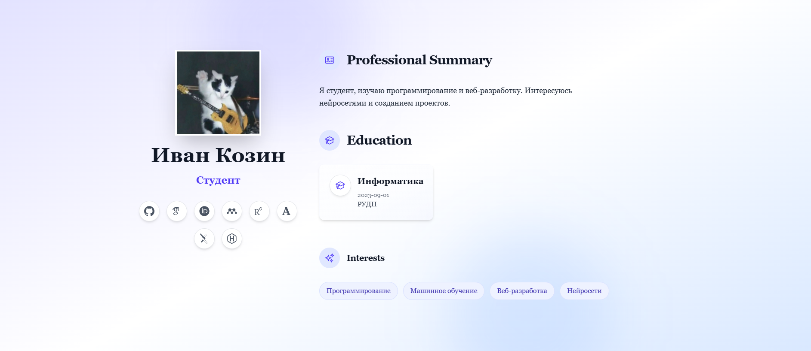
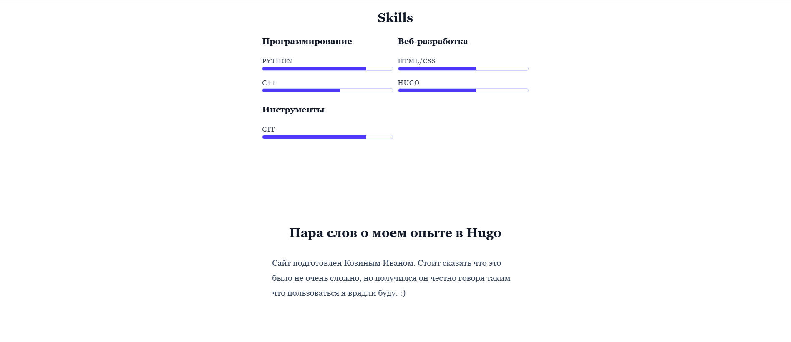
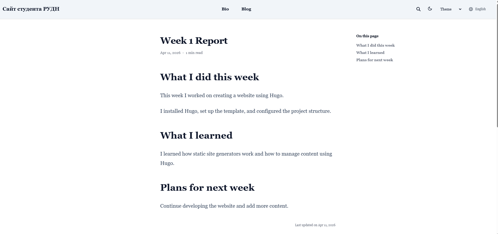
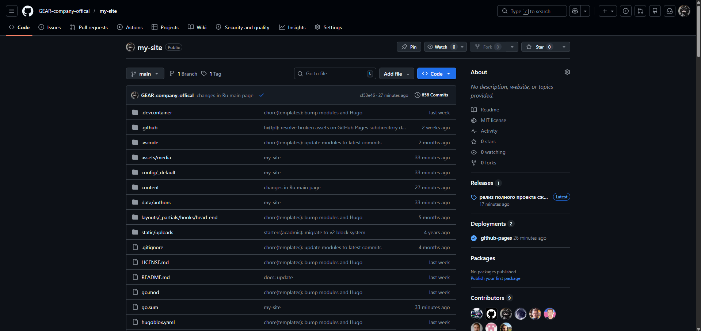
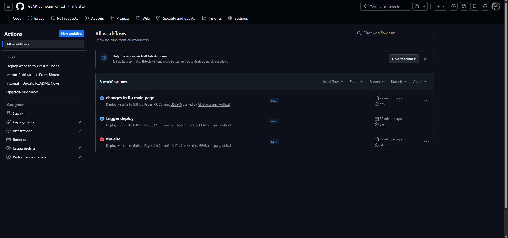
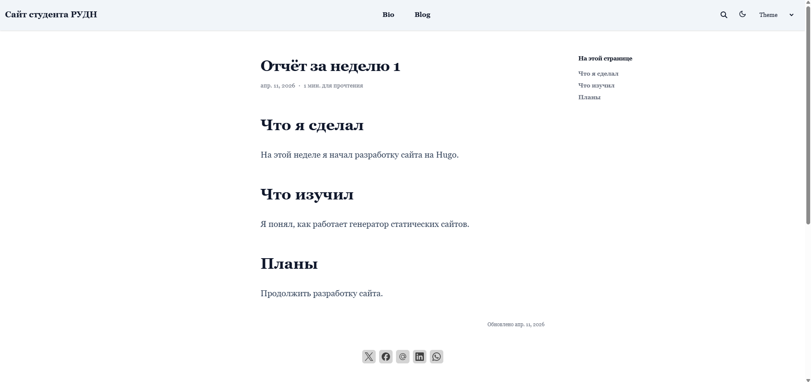
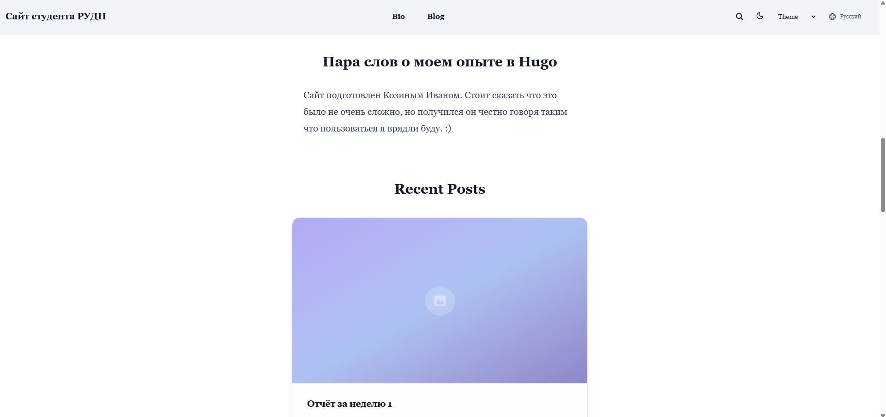

# Отчёт  
## Индивидуальный проект на HUGO  
### Архитектура компьютеров и операционные системы  

**Тема:** Разработка персонального сайта на Hugo  

**Выполнил:** Козин Иван Евгеньевич  
**Группа:** НКАбд-03-25  

---

# Цель работы

Освоить генератор статических сайтов Hugo и разработать персональный сайт с размещением на GitHub Pages.

---

# Используемые технологии

- Hugo (SSG)
- Wowchemy (шаблон)
- Git / GitHub
- Markdown
- Node.js

---

# Выполнение работы

## 1. Установка окружения

- Установлен Hugo  
- Проверена установка (`hugo version`)  
- Установлены Node.js и npm  

---

## 2. Создание проекта

Создан сайт с использованием шаблона Wowchemy:

git clone starter-hugo-academic  
cd my-site  
hugo server  

---

## 3. Настройка конфигурации

Изменён параметр:

baseURL: https://GEAR-company-offical.github.io/my-site/

Настроен язык сайта и структура URL.

---

## 4. Настройка профиля

Заполнены данные:

- имя  
- описание  
- интересы  
- образование  
- навыки  

---

## 5. Добавление контента

Созданы посты:

hugo new content/post/post1.md  

Добавлены статьи и информация о проекте.

---

## 6. Работа с GitHub

- создан репозиторий  
- выполнен push  
- настроен GitHub Pages  

---

## 7. Деплой сайта

Сайт размещён на GitHub Pages  
Проверена доступность по URL  

---

## 8. Двуязычность

Настроены языки:

- русский  
- английский  

Изменена структура URL.

---

# Вывод

- Освоен Hugo  
- Создан персональный сайт  
- Настроен деплой через GitHub  
- Реализована структура контента  
- Получены навыки веб-разработки  